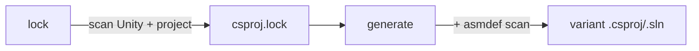

# Unity Solution Generator

Swift CLI that regenerates `.csproj` and `.sln` files for Unity projects from `asmdef`/`asmref` layout, without requiring the Unity Editor.

## Install

```bash
just install
```

Installs to `~/.local/bin/` (symlinks):
- `unity-solution-generator` — the generator binary
- `build-unity-sln` — build script with optimized MSBuild args

## Commands

| Command | Description |
|---------|-------------|
| `lock` | Scan Unity installation + project to generate `csproj.lock` |
| `generate` | Regenerate `.csproj`/`.sln` from lockfile and filesystem |
| `init` | *(deprecated)* Alias for `lock` |

```bash
unity-solution-generator lock .                             # scan + write lockfile
unity-solution-generator generate . ios editor              # ios-editor
unity-solution-generator generate . android prod            # android-prod
```

Positional args: `<command> <unity-root> <platform> <config>`.

### Platform + configuration

Two orthogonal axes: **platform** (`ios`, `android`) and **configuration** (`prod`, `dev`, `editor`).

| Config | Projects | DefineConstants (via Directory.Build.props) |
|--------|----------|---------------------------------------------|
| `prod` | runtime only | platform defines only |
| `dev` | runtime only | platform + `DEBUG;TRACE;UNITY_ASSERTIONS` |
| `editor` | all | platform + `UNITY_EDITOR;UNITY_EDITOR_64;UNITY_EDITOR_OSX;DEBUG;TRACE;UNITY_ASSERTIONS` |

Each invocation produces one variant in `{platform}-{config}/` containing `.csproj` files, a `.sln`, and a `Directory.Build.props`.

## Directory structure

All generator artifacts live under `Library/UnitySolutionGenerator/` (gitignored):

```
Library/UnitySolutionGenerator/
  csproj.lock                     ← lockfile: DLL refs, analyzers, defines
  templates/                      ← (legacy) extracted from Unity-generated .csproj files
  ios-prod/                       ← variant: .csproj + .sln + Directory.Build.props
  ios-editor/
  android-prod/
  ...
```

## Build validation

`build-unity-sln` wraps `unity-solution-generator generate` + `dotnet build` with optimized MSBuild args. On build failure, it automatically re-runs `lock` and retries the failed variants once.

```bash
build-unity-sln ios prod                  # single variant
build-unity-sln ios,android editor,dev    # 4 parallel builds (cartesian product)
build-unity-sln --clean                   # clean cached artifacts (default: ios-editor)
```

Comma-separated platforms/configs are expanded into all combinations and built in parallel. Defaults: platform=`ios`, config=`editor`.

Or call `unity-solution-generator` directly — output is the `.sln` path to stdout:

```bash
dotnet build "$(unity-solution-generator generate . ios prod)" -m --no-restore -v q
```

## How it works



1. **Lock** scans the Unity installation and project filesystem to discover all DLL references, analyzers, and preprocessor defines. No Unity Editor required — it reads from `ProjectSettings/ProjectVersion.txt` to find the Unity install path, then scans `Managed/`, `NetStandard/`, `PlaybackEngines/`, `Assets/`, `Packages/`, and `Library/PackageCache/` for DLLs. Feature defines (`ENABLE_*`) use a hardcoded superset; scripting defines come from `ProjectSettings.asset`; per-asmdef `versionDefines` are evaluated against `manifest.json`. Output: `csproj.lock`.

2. **Generate** reads the lockfile, scans `Assets/` and `Packages/` for `.cs` directories, resolves ownership via `asmdef`/`asmref` assembly roots, and renders complete `.csproj` files (XML header + analyzers + DLL refs + compile patterns + project references). `Directory.Build.props` injects `$(ProjectRoot)`, `$(UnityPath)`, and all defines (static from lockfile + dynamic per variant).

3. **Legacy fallback**: If no lockfile exists but templates do, `generate` uses the old template-based path (with a deprecation warning).

### What lock discovers

| Source | Data |
|--------|------|
| `ProjectVersion.txt` | Unity version, editor install path |
| `Managed/UnityEngine/` | Engine + editor module DLLs |
| `NetStandard/` | System.* shim DLLs |
| `PlaybackEngines/` | Platform-specific extension DLLs |
| `Tools/Unity.SourceGenerators/` | Analyzer DLLs |
| `Assets/`, `Packages/`, `Library/PackageCache/` | Third-party project DLLs + analyzers |
| Unity version string | `UNITY_X_Y_Z`, `_OR_NEWER` defines |
| Hardcoded superset | `ENABLE_*` feature flags |
| `ProjectSettings.asset` | Scripting define symbols |
| asmdef `versionDefines` | Conditional defines per installed package |
| asmdef `allowUnsafeCode` | `AllowUnsafeBlocks` per project |

### Category inference

| Rule | Category |
|------|----------|
| `defineConstraints` contains `"UNITY_INCLUDE_TESTS"` | **test** |
| `includePlatforms` is exactly `["Editor"]` | **editor** |
| `defineConstraints` contains `"UNITY_EDITOR"` | **editor** |
| Everything else | **runtime** |

Platform-specific assemblies (e.g. `includePlatforms: ["iOS", "Editor"]`) are treated as **runtime**, but only included in prod/dev variants when the target platform matches. Editor variants include all projects regardless.

### Source ownership resolution

For each directory containing `.cs` files, the generator walks upward looking for the nearest `asmdef` or `asmref` assembly root. Directories with no assembly root fall back to Unity's legacy assembly rules (`Assembly-CSharp`, `Assembly-CSharp-Editor`, etc.).

### Compile patterns

Per-directory relative glob patterns instead of individual file listings:

```xml
<Compile Include="../../../Assets/Game/*.cs" />
<Compile Include="../../../Assets/Game/Feature/*.cs" />
```

Directories ending with `~` or starting with `.` are excluded from scanning.

## Performance

Benchmarked on meow-tower (13 assemblies, ~26k source files):

| Command | Mean |
|---------|------|
| `lock` | 70ms |
| `generate` (any variant) | 23ms |
| `dotnet build` (ios-editor) | ~2s |

No Foundation dependency — binary links only against libSystem, libswiftCore, libswiftDarwin, and libswiftDispatch. Filesystem scan runs in parallel via GCD.

## Unity project setup

After cloning, or after Unity upgrades / package changes:

```bash
unity-solution-generator lock .
```

The lockfile is auto-generated on first `generate` if missing. Re-run `lock` when Unity version changes or packages are added/removed. `build-unity-sln` auto-retries with a fresh lock on build failure.
