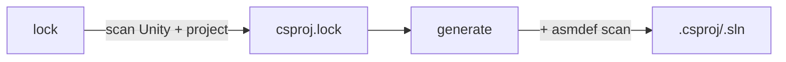

# Unity Solution Generator

Swift CLI and library that regenerates `.csproj` and `.sln` files for Unity projects from `asmdef`/`asmref` layout, without requiring the Unity Editor.

## Build

```bash
just build                    # release binary + dylib → dist/
just test                     # run tests
just install                  # symlink to ~/.local/bin
just profile                  # benchmark against meow-tower
```

**Output** (`dist/`):
- `unity-solution-generator` — CLI binary
- `libUnitySolutionGenerator.dylib` — dynamic library (C ABI via `@_cdecl`)
- `UnitySolutionGenerator.h` — C header for the dylib
- `build-unity-sln.sh` — build script wrapping generate + dotnet build

## CLI

```bash
unity-solution-generator lock .                             # scan + write lockfile
unity-solution-generator generate . ios editor              # default: Library/UnitySolutionGenerator/ios-editor/
unity-solution-generator generate . ios editor --root       # output to project root
unity-solution-generator generate . ios editor \
  --output Library/hotreload/Solution                       # output to custom dir
unity-solution-generator generate . ios editor \
  --extra-refs "/path/to/Extra.dll,/path/to/Other.dll"     # additional DLL references
```

`init` is a deprecated alias for `lock`.

Positional args: `<command> <unity-root> <platform> <config>`. Platform: `ios` | `android` | `osx`. Config: `prod` | `dev` | `editor`.

| Option | Description |
|--------|-------------|
| `-o`, `--output <dir>` | Output to `<dir>` (relative to project root) instead of variant subdir |
| `--root` | Alias for `--output .` (output to project root) |
| `--extra-refs <paths>` | Comma-separated absolute paths to additional DLLs |
| `-v`, `--verbose` | Print unresolved directory samples |

### Platform + configuration

| Config | Projects | DefineConstants (via Directory.Build.props) |
|--------|----------|---------------------------------------------|
| `prod` | runtime only | platform defines only |
| `dev` | runtime only | platform + `DEBUG;TRACE;UNITY_ASSERTIONS` |
| `editor` | all | platform + `UNITY_EDITOR;UNITY_EDITOR_64;UNITY_EDITOR_OSX;DEBUG;TRACE;UNITY_ASSERTIONS` |

Platform defines:

| Platform | Defines |
|----------|---------|
| `ios` | `UNITY_IOS;UNITY_IPHONE` |
| `android` | `UNITY_ANDROID` |
| `osx` | `UNITY_STANDALONE;UNITY_STANDALONE_OSX` |

### Build validation

`build-unity-sln` wraps generate + `dotnet build`. Auto-retries with fresh lock on build failure. Defaults: platform=`ios`, config=`editor`.

```bash
build-unity-sln ios prod                  # single variant
build-unity-sln ios,android editor,dev    # 4 parallel builds (cartesian product)
build-unity-sln osx editor                # macOS standalone (catches UNITY_STANDALONE_OSX errors)
build-unity-sln --clean                   # clean cached artifacts
```

Or call the generator directly — output is the `.sln` path to stdout:

```bash
dotnet build "$(unity-solution-generator generate . ios prod)" -m --no-restore -v q
```

## Library

`libUnitySolutionGenerator.dylib` exposes both a C ABI (for Unity `[DllImport]`) and Swift API.

### C ABI (`dist/UnitySolutionGenerator.h`)

```c
int32_t usg_generate(const char *projectRoot, const char *platform, const char *config,
                     const char *outputDir, const char *extraRefs,
                     char *slnPathOut, int32_t slnPathOutLen);
int32_t usg_lock(const char *projectRoot);
const char *usg_last_error(void);  // valid until next usg_ call
```

C# usage:

```csharp
[DllImport("UnitySolutionGenerator")]
static extern int usg_generate(string projectRoot, string platform, string config,
                               string outputDir, string extraRefs,
                               StringBuilder slnPathOut, int slnPathOutLen);

[DllImport("UnitySolutionGenerator")]
static extern int usg_lock(string projectRoot);

[DllImport("UnitySolutionGenerator")]
static extern IntPtr usg_last_error();

// Usage:
var buf = new StringBuilder(512);
if (usg_generate(root, "ios", "editor", "Library/hotreload/Solution",
                 "/path/to/Extra.dll", buf, buf.Capacity + 1) != 0)
    throw new Exception(Marshal.PtrToStringAnsi(usg_last_error()));
string slnPath = buf.ToString();
```

`outputDir`: relative path, `"."` for project root, `null` for default variant dir. `extraRefs`: comma-separated absolute DLL paths, `null` for none. Both functions auto-resolve the lockfile from `Library/UnitySolutionGenerator/csproj.lock`; `usg_generate` auto-runs lock if the lockfile is missing.

### Swift API (`import SolutionGeneratorCore`)

| Type | Description |
|------|-------------|
| `SolutionGenerator` | `.generateFromLockfile(options:lockfile:)`, `.generate(options:)` |
| `GenerateOptions` | `projectRoot`, `platform`, `buildConfig`, `outputDir`, `extraRefs` |
| `GenerateResult` | `variantSlnPath`, `variantCsprojs`, `warnings` |
| `BuildPlatform` | `.ios`, `.android` |
| `BuildConfig` | `.prod`, `.dev`, `.editor` |
| `LockfileIO` | `.read(from:)` — load lockfile |
| `Lockfile` | Unity version, DLL refs, defines, analyzers (constructible via init or `LockfileIO.read`) |
| `DllRef` | `name`, `path` |
| `RefCategory` | `.engine`, `.editor`, `.netstandard`, `.playbackIos`, `.playbackAndroid`, `.playbackStandalone`, `.project` |

```swift
import SolutionGeneratorCore

let lockfile = try LockfileIO.read(from: "Library/UnitySolutionGenerator/csproj.lock")
let result = try SolutionGenerator().generateFromLockfile(
    options: GenerateOptions(
        projectRoot: projectRoot,
        outputDir: "Library/com.example/Solution",
        extraRefs: [DllRef(name: "MyLib", path: "/abs/path/to/MyLib.dll")],
        platform: .ios,
        buildConfig: .editor
    ),
    lockfile: lockfile
)
// result.variantSlnPath → path to generated .sln
```

## How it works



1. **Lock** scans the Unity installation and project to discover DLL references, analyzers, and preprocessor defines. Reads `ProjectSettings/ProjectVersion.txt` to find the Unity install path, then scans `Managed/`, `NetStandard/`, `PlaybackEngines/`, `Assets/`, `Packages/`, and `Library/PackageCache/`. Output: `csproj.lock`.

2. **Generate** reads the lockfile, scans for `.cs` directories, resolves ownership via `asmdef`/`asmref` assembly roots, and renders `.csproj` files (XML header + analyzers + DLL refs + compile patterns + project references) + `.sln` + `Directory.Build.props` (injects `$(ProjectRoot)`, `$(UnityPath)`, and all defines). `--output` controls compile pattern prefix depth — one `../` per path component from output directory back to project root.

3. **Legacy fallback**: If no lockfile exists but templates do, `generate` uses the old template-based path (with a deprecation warning).

### Category inference

| Rule | Category |
|------|----------|
| `defineConstraints` contains `"UNITY_INCLUDE_TESTS"` | **test** |
| `includePlatforms` is exactly `["Editor"]` | **editor** |
| `defineConstraints` contains `"UNITY_EDITOR"` | **editor** |
| Everything else | **runtime** |

Platform-specific assemblies (e.g. `includePlatforms: ["iOS", "Editor"]`) are treated as **runtime**, but only included in prod/dev variants when the target platform matches. Editor variants include all projects regardless.

### Source ownership

For each directory containing `.cs` files, the generator walks upward to the nearest `asmdef` or `asmref` assembly root. Unresolved directories fall back to Unity's legacy assembly rules (`Assembly-CSharp`, `Assembly-CSharp-Editor`, etc.). Directories ending with `~` or starting with `.` are excluded.

### Directory structure

All generator artifacts live under `Library/UnitySolutionGenerator/` (gitignored):

```
Library/UnitySolutionGenerator/
  csproj.lock                     ← lockfile
  scan-cache                      ← cached filesystem scan (auto-invalidated by mtime)
  ios-editor/                     ← variant: .csproj + .sln + Directory.Build.props
  android-prod/
  ...
```

## Performance

Benchmarked on meow-tower (13 assemblies, ~5k .cs files) via `hyperfine`:

| Command | Mean ± σ |
|---------|----------|
| `generate` (warm cache) | 11.5 ± 0.6 ms |
| `generate --root` | 11.8 ± 0.6 ms |
| `lock` | 49.3 ± 0.5 ms |
| startup (`--help`) | 1.8 ± 0.4 ms |

Generate caches filesystem scan results (`scan-cache`) with nanosecond-precision directory mtimes. Cache validated via `stat()` (~1ms) instead of full readdir (~21ms). Any file add/remove/change invalidates the cache and triggers a full re-scan.

No Foundation dependency — binary links only against libSystem, libswiftCore, libswiftDarwin, and libswiftDispatch.

## Unity project setup

```bash
unity-solution-generator lock .
```

Re-run `lock` when Unity version changes or packages are added/removed. The lockfile is auto-generated on first `generate` if missing. `build-unity-sln` auto-retries with a fresh lock on build failure.
