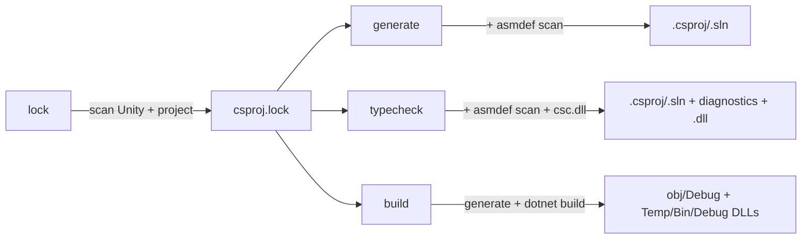

# Unity Solution Generator

> **Related:** [[architecture.md]], [[library-api.md]], [[benchmark.md]], [[TODO.md]]

Rust CLI and library that regenerates `.csproj` and `.sln` files for Unity projects from `asmdef`/`asmref` layout, without requiring the Unity Editor.

Single crate at `crates/usg-core/` (lib + companion binary `unity-solution-generator`), published to crates.io as `unity-solution-generator`. FFI/cdylib lives outside this repo — meow-tower's `BoxcatBridge` consumes the rlib and exposes a `bxc_usg_generate` C ABI.

**Required runtime dep:** [Watchman](https://facebook.github.io/watchman/). Project filesystem scanning is delegated to the daemon; no fallback. Install: `brew install watchman` / `choco install watchman` / per-distro package. MSRV: Rust 1.89 (for `std::fs::File::{lock, try_lock, unlock}`).

## Build

```bash
just build                    # release binary → dist/ (gitignored)
just test                     # run tests
just install                  # build from source + symlink to ~/.local/bin (Rust toolchain required)
just profile                  # benchmark against meow-tower
just release 0.1.1            # bump version, tag, push — CI builds + uploads binary to GH Releases
just publish                  # cargo publish to crates.io (run after `just release` + CI green)
```

**Output** (`dist/`, gitignored):
- `unity-solution-generator` — CLI binary

## Distribution

| Audience | Channel | Command |
|---|---|---|
| You (dev, Rust toolchain installed) | local build | `just install` |
| Coworkers (no Rust toolchain) | GH Releases prebuilt binary | provisioned independently |
| meow-tower's `BoxcatBridge` | crates.io rlib | `cargo` resolves transitively |

`just release <version>` cuts the GH Release: bumps `Cargo.toml`, commits, tags `v<version>`, pushes. The `.github/workflows/release.yml` workflow runs a matrix build (`macos-14` arm64 + `windows-2022` x64) and uploads both binaries as release assets.

## CLI

```bash
unity-solution-generator lock .                             # scan + write lockfile
unity-solution-generator generate . ios editor              # default: Library/UnitySolutionGenerator/ios-editor/
unity-solution-generator generate . ios editor \
  --extra-refs "/path/to/Extra.dll,/path/to/Other.dll"     # additional DLL references
unity-solution-generator typecheck .                        # compile-check (defaults: ios editor); direct csc.dll, no MSBuild
unity-solution-generator build .                            # generate + `dotnet build` (defaults: ios editor, -v:q)
unity-solution-generator build . ios prod -- -m --no-restore -v:n  # forward args after `--` to dotnet build
```

Positional args: `<command> <unity-root> <platform> <config>`. Platform: `ios` | `android` | `osx` | `windows`. Config: `prod` | `dev` | `editor`.

| Option | Description |
|--------|-------------|
| `--extra-refs <paths>` | Comma-separated absolute paths to additional DLLs |

### Platform + configuration

| Config | Projects | DefineConstants (via Directory.Build.props) |
|--------|----------|---------------------------------------------|
| `prod` | runtime only | platform defines only |
| `dev` | runtime only | platform + `DEBUG;TRACE;UNITY_ASSERTIONS` |
| `editor` | all | platform + `UNITY_EDITOR;UNITY_EDITOR_64;UNITY_EDITOR_<HOST>;DEBUG;TRACE;UNITY_ASSERTIONS` |

`UNITY_EDITOR_<HOST>` is `UNITY_EDITOR_OSX` / `UNITY_EDITOR_WIN` / `UNITY_EDITOR_LINUX` depending on where `usg` runs (`cfg!(target_os)`).

Platform defines (target — independent of host):

| Platform | Defines |
|----------|---------|
| `ios` | `UNITY_IOS;UNITY_IPHONE` |
| `android` | `UNITY_ANDROID` |
| `osx` | `UNITY_STANDALONE;UNITY_STANDALONE_OSX` |
| `windows` | `UNITY_STANDALONE;UNITY_STANDALONE_WIN` |

### Compile validation (`typecheck`)

`unity-solution-generator typecheck` validates that the project compiles by invoking `csc.dll` directly per asmdef — no MSBuild involved. It also refreshes `.csproj`/`.sln` first (same path as `generate`, Watchman-clock-cached) so Rider/IDE always sees a current solution off a single command. Platform and config default to `ios editor`; pass alternatives explicitly (`typecheck android dev` etc.). The per-asmdef DLL output is deterministic and byte-identical for unchanged inputs (cascade-skip relies on this), and never the artifact Unity ships (Unity rebuilds the solution itself). Mechanics in [[architecture.md]]; benchmarks in [[benchmark.md]].

For full IL output (rarely needed since Unity rebuilds the solution itself), use `build`, which generates the `.sln` and shells out to `dotnet build`:

```bash
unity-solution-generator build .                                   # defaults: ios editor, `-v:q`
unity-solution-generator build . ios prod -- -m --no-restore -v:q  # forward args after `--`
```

## Library API

Rust API reference: [[library-api.md]]. The C ABI (for Unity `[DllImport]`) is hosted downstream in meow-tower's BoxcatBridge — not in this crate.

## How it works

Subcommands share a scan + lockfile:



`build` and `typecheck` share the same per-variant `obj/Debug/<asmdef>.dll` output path — `build` adds `.pdb` + MSBuild's incremental caches and copies into `Temp/Bin/Debug/<asmdef>/` (hundreds of MB on large projects). `typecheck` adds `<asmdef>.dll.usg-stamp` per emit; the stamp lets the next typecheck detect MSBuild overwrites and recompile. Use `typecheck` when you only need diagnostics.

Mechanics — category-inference rules, source-ownership walk, on-disk layout, cache versioning, typecheck internals — live in [[architecture.md]].

## Performance

End-to-end + microbenchmark numbers, per-section profiling output, caching-layer details, concurrency notes, and `USG_PROFILE` instrumentation: see [[benchmark.md]].

Quick refs:
- `just profile` / `just profile-spans` — meow-tower wall-clock + per-section breakdown
- `just bench` — criterion microbenchmarks
- `USG_PROFILE=1 unity-solution-generator <cmd>` — opt-in tracing spans

## Unity project setup

```bash
unity-solution-generator lock .
```

Every `generate` / `typecheck` / `build` invocation validates the lockfile by:
1. Comparing `lockfile.unity-version` against the current `ProjectSettings/ProjectVersion.txt`.
2. Querying Watchman with the previous `.lock-watchman-clock` cursor — if any project-relevant path (`.cs`/`.asmdef`/`.asmref`/`.dll`/manifest) changed, the lockfile is rescanned.

On a cache hit the check costs ~ms; manual `lock` is only needed when you want to force-rescan without running a subcommand.
