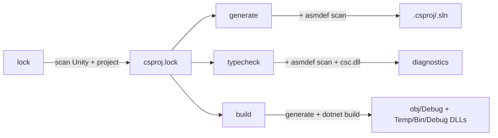

# Unity Solution Generator

> **Related:** [[architecture.md]], [[library-api.md]], [[benchmark.md]], [[TODO.md]]

Rust CLI and library that regenerates `.csproj` and `.sln` files for Unity projects from `asmdef`/`asmref` layout, without requiring the Unity Editor.

Single crate at `crates/usg-core/` (lib + companion binary `unity-solution-generator`), published to crates.io as `unity-solution-generator`. FFI/cdylib lives outside this repo — meow-tower's `BoxcatBridge` consumes the rlib and exposes a `bxc_usg_generate` C ABI.

## Build

```bash
just build                    # release binary → dist/
just test                     # run tests
just install                  # symlink to ~/.local/bin
just profile                  # benchmark against meow-tower
just publish                  # cargo publish (irreversible)
```

**Output** (`dist/`):
- `unity-solution-generator` — CLI binary

## CLI

```bash
unity-solution-generator lock .                             # scan + write lockfile
unity-solution-generator generate . ios editor              # default: Library/UnitySolutionGenerator/ios-editor/
unity-solution-generator generate . ios editor \
  --extra-refs "/path/to/Extra.dll,/path/to/Other.dll"     # additional DLL references
unity-solution-generator typecheck .                        # compile-check (defaults: ios editor); direct csc.dll, no MSBuild
unity-solution-generator build . ios prod                   # generate + `dotnet build` (default: -v:q)
unity-solution-generator build . ios prod -- -m --no-restore -v:n  # forward args after `--` to dotnet build
```

Positional args: `<command> <unity-root> <platform> <config>`. Platform: `ios` | `android` | `osx`. Config: `prod` | `dev` | `editor`.

| Option | Description |
|--------|-------------|
| `--extra-refs <paths>` | Comma-separated absolute paths to additional DLLs |

### Platform + configuration

| Config | Projects | DefineConstants (via Directory.Build.props) |
|--------|----------|---------------------------------------------|
| `prod` | runtime only | platform defines only |
| `dev` | runtime only | platform + `DEBUG;TRACE;UNITY_ASSERTIONS` |
| `editor` | all | platform + `UNITY_EDITOR;UNITY_EDITOR_64;UNITY_EDITOR_OSX;DEBUG;TRACE;UNITY_ASSERTIONS` |

Platform defines:

| Platform | Defines |
|----------|---------|
| `ios` | `UNITY_IOS;UNITY_IPHONE` |
| `android` | `UNITY_ANDROID` |
| `osx` | `UNITY_STANDALONE;UNITY_STANDALONE_OSX` |

### Compile validation (`typecheck`)

`unity-solution-generator typecheck` validates that the project compiles by invoking `csc.dll` directly per asmdef — no MSBuild involved. Platform and config default to `ios editor`; pass alternatives explicitly (`typecheck android dev` etc.). Output is a deterministic library DLL per asmdef — byte-identical for unchanged inputs (cascade-skip relies on this), and never the artifact Unity ships (Unity rebuilds the solution itself). Mechanics in [[architecture.md]]; benchmarks in [[benchmark.md]].

For full IL output (rarely needed since Unity rebuilds the solution itself), use `build`, which generates the `.sln` and shells out to `dotnet build`:

```bash
unity-solution-generator build . ios prod                          # default `-v:q`
unity-solution-generator build . ios prod -- -m --no-restore -v:q  # forward args after `--`
```

## Library API

C ABI (for Unity `[DllImport]`) and Rust API (`usg-core` crate) reference: see [[library-api.md]].

## How it works

Subcommands share a scan + lockfile:



`build` writes MSBuild artifacts under the same variant directory `generate` emits to: assemblies land in `obj/Debug/<asmdef>.dll`, with per-project copies of every reference DLL under `Temp/Bin/Debug/<asmdef>/`. Disk usage is significant (hundreds of MB on large projects) — `typecheck` is the lighter option when you only need diagnostics.

Mechanics — category-inference rules, source-ownership walk, on-disk layout, cache versioning, typecheck internals — live in [[architecture.md]].

## Performance

End-to-end + microbenchmark numbers, per-section profiling output, caching-layer details, concurrency notes, and `USG_PROFILE` instrumentation: see [[benchmark.md]].

Quick refs:
- `just profile` / `just profile-spans` — meow-tower wall-clock + per-section breakdown
- `just bench` — criterion microbenchmarks
- `USG_PROFILE=1 unity-solution-generator <cmd>` — opt-in tracing spans

## Unity project setup

```bash
unity-solution-generator lock .
```

Re-run `lock` when Unity version changes or packages are added/removed. The lockfile is auto-generated on first `generate` / `typecheck` if missing. Most environment changes (new files, populated `Library/PackageCache/`, edited asmdefs) auto-invalidate via `lock-fingerprint`; manual re-lock is rarely needed.
