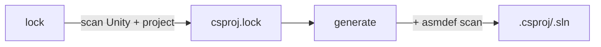

# Unity Solution Generator

> **Related:** [[architecture.md]], [[library.md]], [[benchmark.md]], [[TODO.md]]

Rust CLI and library that regenerates `.csproj` and `.sln` files for Unity projects from `asmdef`/`asmref` layout, without requiring the Unity Editor.

Cargo workspace under `crates/`:
- `usg-core` — library (paths, lockfile, scanners, generator)
- `usg-cli` — binary (`unity-solution-generator`)
- `usg-ffi` — `cdylib` (`libUnitySolutionGenerator.dylib`) with the C ABI used by Unity `[DllImport]`

## Build

```bash
just build                    # release binary + dylib → dist/
just test                     # run tests
just install                  # symlink to ~/.local/bin
just profile                  # benchmark against meow-tower
```

**Output** (`dist/`):
- `unity-solution-generator` — CLI binary
- `libUnitySolutionGenerator.dylib` — dynamic library (C ABI via `#[unsafe(no_mangle)] extern "C"`)
- `UnitySolutionGenerator.h` — C header for the dylib (hand-maintained)
- `build-unity-sln.sh` — build script wrapping generate + dotnet build

## CLI

```bash
unity-solution-generator lock .                             # scan + write lockfile
unity-solution-generator generate . ios editor              # default: Library/UnitySolutionGenerator/ios-editor/
unity-solution-generator generate . ios editor \
  --extra-refs "/path/to/Extra.dll,/path/to/Other.dll"     # additional DLL references
unity-solution-generator typecheck . ios editor             # validate compile via direct csc (partial — see TODO)
```

Positional args: `<command> <unity-root> <platform> <config>`. Platform: `ios` | `android` | `osx`. Config: `prod` | `dev` | `editor`.

| Option | Description |
|--------|-------------|
| `--extra-refs <paths>` | Comma-separated absolute paths to additional DLLs |

### Platform + configuration

| Config | Projects | DefineConstants (via Directory.Build.props) |
|--------|----------|---------------------------------------------|
| `prod` | runtime only | platform defines only |
| `dev` | runtime only | platform + `DEBUG;TRACE;UNITY_ASSERTIONS` |
| `editor` | all | platform + `UNITY_EDITOR;UNITY_EDITOR_64;UNITY_EDITOR_OSX;DEBUG;TRACE;UNITY_ASSERTIONS` |

Platform defines:

| Platform | Defines |
|----------|---------|
| `ios` | `UNITY_IOS;UNITY_IPHONE` |
| `android` | `UNITY_ANDROID` |
| `osx` | `UNITY_STANDALONE;UNITY_STANDALONE_OSX` |

### Build validation

`build-unity-sln` wraps generate + `dotnet build`. Auto-retries with fresh lock on build failure. Defaults: platform=`ios`, config=`editor`.

```bash
build-unity-sln ios prod                  # single variant (fast compile-check)
build-unity-sln ios,android editor,dev    # 4 parallel builds (cartesian product)
build-unity-sln osx editor                # macOS standalone (catches UNITY_STANDALONE_OSX errors)
build-unity-sln --clean                   # clean cached artifacts
build-unity-sln --emit ios editor         # full build with runnable IL (slower; rarely needed)
```

The default is a fast compile-check: Roslyn emits metadata-only ref assemblies (no IL, no method bodies), analyzers/pdb/post-compile copies skipped, MSBuild Server persists across calls. ~2× faster than `--emit`. Output is NOT runnable — Unity does the real build.

Pass `--emit` only when you need actual IL output (e.g. running the assemblies outside Unity). Benchmarks: [[benchmark.md]].

**Pitfalls of the default (no-emit) mode:**
- Output assemblies are ref-only stubs — not runnable.
- Alternating default and `--emit` invalidates MSBuild's up-to-date check (different artifact at same path) → first run after toggle is a full rebuild. Pin each workflow to one mode.

Less-likely-to-bite pitfalls (rare-Roslyn diagnostic gaps, source generators still running): see [[benchmark.md]].

Or call the generator directly — output is the `.sln` path to stdout:

```bash
dotnet build "$(unity-solution-generator generate . ios prod)" -m --no-restore -v:q
```

## Library API

C ABI (for Unity `[DllImport]`) and Rust API (`usg-core` crate) reference: see [[library.md]].

## How it works



1. **Lock** scans the Unity installation and project to discover DLL references, analyzers, and preprocessor defines. Reads `ProjectSettings/ProjectVersion.txt` to find the Unity install path, then scans `Managed/`, `NetStandard/`, `PlaybackEngines/`, `Assets/`, `Packages/`, and `Library/PackageCache/`. Output: `csproj.lock`.

2. **Generate** reads the lockfile, scans for `.cs` directories, resolves ownership via `asmdef`/`asmref` assembly roots, and renders `.csproj` files (XML header + analyzers + DLL refs + compile patterns + project references) + `.sln` + `Directory.Build.props` (injects `$(ProjectRoot)`, `$(UnityPath)`, and all defines). The output directory (defaulted to `Library/UnitySolutionGenerator/<variant>/`, overridable via the Rust API's `with_output_dir`) controls compile pattern prefix depth — one `../` per path component back to project root.


### Category inference

| Rule | Category |
|------|----------|
| `defineConstraints` contains `"UNITY_INCLUDE_TESTS"` | **test** |
| `includePlatforms` is exactly `["Editor"]` | **editor** |
| `defineConstraints` contains `"UNITY_EDITOR"` | **editor** |
| Everything else | **runtime** |

Platform-specific assemblies (e.g. `includePlatforms: ["iOS", "Editor"]`) are treated as **runtime**, but only included in prod/dev variants when the target platform matches. Editor variants include all projects regardless.

### Source ownership

For each directory containing `.cs` files, the generator walks upward to the nearest `asmdef` or `asmref` assembly root. Unresolved directories fall back to Unity's legacy assembly rules (`Assembly-CSharp`, `Assembly-CSharp-Editor`, etc.). Directories ending with `~` or starting with `.` are excluded.

### Directory structure

All generator artifacts live under `Library/UnitySolutionGenerator/` (gitignored):

```
Library/UnitySolutionGenerator/
  csproj.lock                     ← lockfile (user-visible, may be checked in)
  scan-cache                      ← cached filesystem scan (mtime-validated)
  lock-fingerprint                ← short-circuits `lock` when nothing changed
  .fingerprints/<options-hash>    ← short-circuits `generate` when nothing changed
  ios-editor/                     ← variant: .csproj + .sln + Directory.Build.props
  android-prod/
  typecheck-ios-editor/           ← variant: csc-emitted ref-only .dlls + .rsp files (typecheck subcommand)
  ...
```

Cache files are version-headed (`CACHE_VERSION` in `lib.rs`); a constant bump triggers wholesale cold rebuild. The user-visible `csproj.lock` has its own `LOCKFILE_VERSION` so dev-local cache changes don't touch checked-in lockfiles.

## Performance

End-to-end + microbenchmark numbers, per-section profiling output, caching-layer details, concurrency notes, and `USG_PROFILE` instrumentation: see [[benchmark.md]].

Quick refs:
- `just profile` / `just profile-spans` — meow-tower wall-clock + per-section breakdown
- `just bench` — criterion microbenchmarks
- `USG_PROFILE=1 unity-solution-generator <cmd>` — opt-in tracing spans

## Unity project setup

```bash
unity-solution-generator lock .
```

Re-run `lock` when Unity version changes or packages are added/removed. The lockfile is auto-generated on first `generate` if missing. `build-unity-sln` auto-retries with a fresh lock on build failure.
