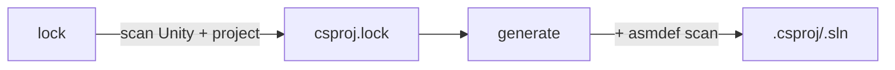

# Unity Solution Generator

Rust CLI and library that regenerates `.csproj` and `.sln` files for Unity projects from `asmdef`/`asmref` layout, without requiring the Unity Editor.

Cargo workspace under `crates/`:
- `usg-core` — library (paths, lockfile, scanners, generator, template extractor)
- `usg-cli` — binary (`unity-solution-generator`)
- `usg-ffi` — `cdylib` (`libUnitySolutionGenerator.dylib`) with the C ABI used by Unity `[DllImport]`

## Build

```bash
just build                    # release binary + dylib → dist/
just test                     # run tests
just install                  # symlink to ~/.local/bin
just profile                  # benchmark against meow-tower
```

**Output** (`dist/`):
- `unity-solution-generator` — CLI binary
- `libUnitySolutionGenerator.dylib` — dynamic library (C ABI via `#[unsafe(no_mangle)] extern "C"`)
- `UnitySolutionGenerator.h` — C header for the dylib (hand-maintained)
- `build-unity-sln.sh` — build script wrapping generate + dotnet build

## CLI

```bash
unity-solution-generator lock .                             # scan + write lockfile
unity-solution-generator generate . ios editor              # default: Library/UnitySolutionGenerator/ios-editor/
unity-solution-generator generate . ios editor --root       # output to project root
unity-solution-generator generate . ios editor \
  --output Library/hotreload/Solution                       # output to custom dir
unity-solution-generator generate . ios editor \
  --extra-refs "/path/to/Extra.dll,/path/to/Other.dll"     # additional DLL references
```

`init` is a deprecated alias for `lock`.

Positional args: `<command> <unity-root> <platform> <config>`. Platform: `ios` | `android` | `osx`. Config: `prod` | `dev` | `editor`.

| Option | Description |
|--------|-------------|
| `-o`, `--output <dir>` | Output to `<dir>` (relative to project root) instead of variant subdir |
| `--root` | Alias for `--output .` (output to project root) |
| `--extra-refs <paths>` | Comma-separated absolute paths to additional DLLs |
| `-v`, `--verbose` | Print unresolved directory samples |

### Platform + configuration

| Config | Projects | DefineConstants (via Directory.Build.props) |
|--------|----------|---------------------------------------------|
| `prod` | runtime only | platform defines only |
| `dev` | runtime only | platform + `DEBUG;TRACE;UNITY_ASSERTIONS` |
| `editor` | all | platform + `UNITY_EDITOR;UNITY_EDITOR_64;UNITY_EDITOR_OSX;DEBUG;TRACE;UNITY_ASSERTIONS` |

Platform defines:

| Platform | Defines |
|----------|---------|
| `ios` | `UNITY_IOS;UNITY_IPHONE` |
| `android` | `UNITY_ANDROID` |
| `osx` | `UNITY_STANDALONE;UNITY_STANDALONE_OSX` |

### Build validation

`build-unity-sln` wraps generate + `dotnet build`. Auto-retries with fresh lock on build failure. Defaults: platform=`ios`, config=`editor`.

```bash
build-unity-sln ios prod                  # single variant
build-unity-sln ios,android editor,dev    # 4 parallel builds (cartesian product)
build-unity-sln osx editor                # macOS standalone (catches UNITY_STANDALONE_OSX errors)
build-unity-sln --clean                   # clean cached artifacts
```

Or call the generator directly — output is the `.sln` path to stdout:

```bash
dotnet build "$(unity-solution-generator generate . ios prod)" -m --no-restore -v q
```

## Library

`libUnitySolutionGenerator.dylib` exposes a C ABI (for Unity `[DllImport]`) plus a Rust API via the `usg-core` crate.

### C ABI (`dist/UnitySolutionGenerator.h`)

```c
int32_t usg_generate(const char *projectRoot, const char *platform, const char *config,
                     const char *outputDir, const char *extraRefs,
                     char *slnPathOut, int32_t slnPathOutLen);
int32_t usg_lock(const char *projectRoot);
const char *usg_last_error(void);  // valid until next usg_ call
```

C# usage:

```csharp
[DllImport("UnitySolutionGenerator")]
static extern int usg_generate(string projectRoot, string platform, string config,
                               string outputDir, string extraRefs,
                               StringBuilder slnPathOut, int slnPathOutLen);

[DllImport("UnitySolutionGenerator")]
static extern int usg_lock(string projectRoot);

[DllImport("UnitySolutionGenerator")]
static extern IntPtr usg_last_error();

// Usage:
var buf = new StringBuilder(512);
if (usg_generate(root, "ios", "editor", "Library/hotreload/Solution",
                 "/path/to/Extra.dll", buf, buf.Capacity + 1) != 0)
    throw new Exception(Marshal.PtrToStringAnsi(usg_last_error()));
string slnPath = buf.ToString();
```

`outputDir`: relative path, `"."` for project root, `null` for default variant dir. `extraRefs`: comma-separated absolute DLL paths, `null` for none. Both functions auto-resolve the lockfile from `Library/UnitySolutionGenerator/csproj.lock`; `usg_generate` auto-runs lock if the lockfile is missing.

### Rust API (`use usg_core::*`)

| Type | Description |
|------|-------------|
| `SolutionGenerator` | `.generate_from_lockfile(&options, &lockfile)`, `.generate(&options)` |
| `GenerateOptions` | builder: `new(root, platform).with_build_config(...).with_output_dir(...).with_extra_refs(...)` |
| `GenerateResult` | `variant_sln_path`, `variant_csprojs`, `warnings` |
| `BuildPlatform` | `Ios`, `Android`, `Osx` |
| `BuildConfig` | `Prod`, `Dev`, `Editor` |
| `LockfileIO` | `::read(path)`, `::write(&lf, path)`, `::scan_and_write(root)`, `::load_or_scan(root)` |
| `Lockfile` | Unity version, DLL refs, defines, analyzers (struct literal or `LockfileIO::read`) |
| `DllRef` | `name`, `path` (and `DllRef::parse_list` for the comma-separated CLI form) |
| `RefCategory` | `Engine`, `Editor`, `Netstandard`, `PlaybackIos`, `PlaybackAndroid`, `PlaybackStandalone`, `Project` |

```rust
use usg_core::{BuildConfig, BuildPlatform, DllRef, GenerateOptions, LockfileIO, SolutionGenerator};

let lockfile = LockfileIO::read("Library/UnitySolutionGenerator/csproj.lock")?;
let options = GenerateOptions::new(project_root, BuildPlatform::Ios)
    .with_build_config(BuildConfig::Editor)
    .with_output_dir(Some("Library/com.example/Solution"))
    .with_extra_refs(vec![DllRef::new("MyLib", "/abs/path/to/MyLib.dll")]);
let result = SolutionGenerator::new().generate_from_lockfile(&options, &lockfile)?;
// result.variant_sln_path → path to generated .sln
```

## How it works



1. **Lock** scans the Unity installation and project to discover DLL references, analyzers, and preprocessor defines. Reads `ProjectSettings/ProjectVersion.txt` to find the Unity install path, then scans `Managed/`, `NetStandard/`, `PlaybackEngines/`, `Assets/`, `Packages/`, and `Library/PackageCache/`. Output: `csproj.lock`.

2. **Generate** reads the lockfile, scans for `.cs` directories, resolves ownership via `asmdef`/`asmref` assembly roots, and renders `.csproj` files (XML header + analyzers + DLL refs + compile patterns + project references) + `.sln` + `Directory.Build.props` (injects `$(ProjectRoot)`, `$(UnityPath)`, and all defines). `--output` controls compile pattern prefix depth — one `../` per path component from output directory back to project root.

3. **Legacy fallback**: If no lockfile exists but templates do, `generate` uses the old template-based path (with a deprecation warning).

### Category inference

| Rule | Category |
|------|----------|
| `defineConstraints` contains `"UNITY_INCLUDE_TESTS"` | **test** |
| `includePlatforms` is exactly `["Editor"]` | **editor** |
| `defineConstraints` contains `"UNITY_EDITOR"` | **editor** |
| Everything else | **runtime** |

Platform-specific assemblies (e.g. `includePlatforms: ["iOS", "Editor"]`) are treated as **runtime**, but only included in prod/dev variants when the target platform matches. Editor variants include all projects regardless.

### Source ownership

For each directory containing `.cs` files, the generator walks upward to the nearest `asmdef` or `asmref` assembly root. Unresolved directories fall back to Unity's legacy assembly rules (`Assembly-CSharp`, `Assembly-CSharp-Editor`, etc.). Directories ending with `~` or starting with `.` are excluded.

### Directory structure

All generator artifacts live under `Library/UnitySolutionGenerator/` (gitignored):

```
Library/UnitySolutionGenerator/
  csproj.lock                     ← lockfile
  scan-cache                      ← cached filesystem scan (auto-invalidated by mtime)
  ios-editor/                     ← variant: .csproj + .sln + Directory.Build.props
  android-prod/
  ...
```

## Performance

Two layers of measurement: end-to-end wall-clock (`hyperfine`) and statistical microbenchmarks (`criterion`).

### End-to-end (meow-tower, 13 assemblies, ~5k .cs files)

`hyperfine --warmup 10 --runs 200 --shell=none`:

| Command | Mean ± σ | Range |
|---------|----------|-------|
| `generate` (warm — fingerprint hit) | **2.1 ± 0.5 ms** | 1.6–5.6 |
| `generate` (warm scan-cache, fingerprint missing) | ~5.6 ± 1.0 ms | 4.2–9.8 |
| `generate --root` | **5.5 ± 0.5 ms** | 4.9–7.9 |
| `lock` (cold, fingerprint nuked each run) | **29.8 ± 2.4 ms** | 26.1–33.7 |
| `lock` (warm — fingerprint hit) | **1.8 ± 0.2 ms** | 1.6–3.1 |
| startup (`--help`) | ~2 ms | — |

Run via `just profile` (cold lock + warm lock) or `just profile-spans` (per-section breakdown via tracing).

### Per-section (one run, USG_PROFILE=1)

```
generate (5.78 ms total)
├─ project_scanner.scan         4.66 ms
│  └─ scan_cache.validate       2.82 ms
└─ generate.write_variant n=9   0.64 ms

lock cold (47.1 ms total)
├─ lockfile_scanner.unity_install   0.90 ms     ← walkdir, sequential, small
├─ lockfile_scanner.project_walk   45.1  ms     ← ignore parallel walk of PackageCache
└─ lockfile_scanner.defines         0.71 ms

lock warm
└─ (no spans — fingerprint match short-circuits before LockfileScanner runs)
```

### Microbenchmarks (criterion, synthetic projects)

```
project_scanner.scan/13asm_x_50cs       33.2 ms     (cold, full walk)
project_scanner.scan/100asm_x_200cs    946.6 ms     (cold, full walk)
project_scanner.scan_warm/13asm_x_50cs   0.22 ms    (cache hit, ~150× speedup)
project_scanner.scan_warm/100asm_x_200cs 1.59 ms

generate.from_lockfile/13asm_x_50cs      0.51 ms
generate.from_lockfile/100asm_x_200cs    2.81 ms

lockfile_io/write_initial               13.5 µs
lockfile_io/read                        14.1 µs
```

Run via `just bench` (all) or `just bench scan` (filter).

### Caching layers

| Cache | Path | Invalidates on | Hot-path skip |
|---|---|---|---|
| `generate-fingerprint` | `Library/UnitySolutionGenerator/.fingerprints/<options-hash>` | mtime of `csproj.lock` or `scan-cache`; or any expected output file missing | entire `generate_from_lockfile` body — render+write skipped, cached `GenerateResult` returned |
| `scan-cache` | `Library/UnitySolutionGenerator/scan-cache` | mtime of any contributing dir + each asmdef/asmref file (catches in-place edits — parent-dir mtime alone misses these) | full filesystem walk + per-asmdef JSON parse (records are pre-serialized into the cache) |
| `lock-fingerprint` | `Library/UnitySolutionGenerator/lock-fingerprint` | mtime of Unity install + any contributing dir + ProjectVersion / ProjectSettings / manifest.json | entire Unity-install + project-side DLL/asmdef walk |

Both caches store nanosecond mtimes via `MetadataExt::mtime_nsec`. Validation cost is `len(entries) × stat()` (~1–2 ms for hundreds of entries).

### Concurrency

- The hot project-side scan uses [`ignore::WalkBuilder::build_parallel`](https://docs.rs/ignore/) with all gitignore behaviour disabled — we want only the parallel walker scaffolding (crossbeam-deque work-stealing + per-thread accumulators flushed on `Drop`).
- The lockfile-side DLL/asmdef walk over `Assets`/`Packages`/`Library/PackageCache` also uses `ignore::WalkBuilder::build_parallel`. The Unity-install DLL scan stays sequential (`walkdir`) — small enough not to matter.
- `csproj` writes fan out across threads via `rayon`.

### Profiling instrumentation

Spans use [`tracing`](https://docs.rs/tracing/). Default off — zero runtime cost. Opt in:
- `USG_PROFILE=1 unity-solution-generator <cmd>` — info-level spans, one stderr line per span close with `time.busy`.
- `USG_PROFILE=full` — includes lower-level child spans.
- `USG_LOG=usg_core::project_scanner=debug` — drop-in `EnvFilter` directives override the default.

## Unity project setup

```bash
unity-solution-generator lock .
```

Re-run `lock` when Unity version changes or packages are added/removed. The lockfile is auto-generated on first `generate` if missing. `build-unity-sln` auto-retries with a fresh lock on build failure.
