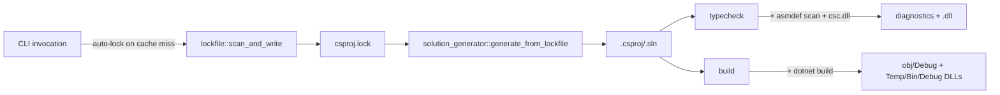
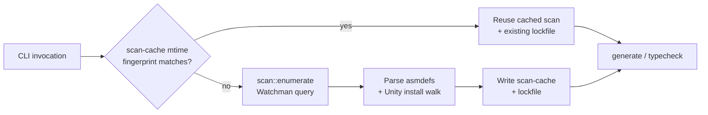

# Architecture

> **Related:** [[CLAUDE.md]], [[library-api.md]], [[benchmark.md]], [[TODO.md]]

How the tool is shaped, why, and what each piece does. Sized for a ~3.5 k-LOC project with four caller sites — none are CI, none are external repos beyond `meow-tower` + `meow-tower-porting`.

## Use cases

Audit found exactly **four caller sites** total. The design is sized for these and nothing else.

| Consumer | Channel | Surface |
|---|---|---|
| `meow-tower` Hot Reload pre-flight (`justfile:105`) | CLI | `unity-solution-generator typecheck` exit code |
| `meow-tower-porting` (same recipe) | CLI | same |
| Rider in-Editor regen (`ProjectGeneration.cs:90`) | FFI | `bxc_usg_generate(...)` + `bxc_last_error()` via meow-tower's BoxcatBridge (which crates.io-deps this crate) |
| Rider in-Editor regen (porting) | FFI | same |

No CI, no other repos, no other tools.

## Build targets + hosts

| Concept | Variants |
|---|---|
| Build target (`BuildPlatform`) | `ios` &#124; `android` &#124; `osx` &#124; `windows` |
| Build config (`BuildConfig`) | `editor` &#124; `dev` &#124; `prod` |
| Host (where `usg` runs) | macOS arm64, Windows x64, Linux (untested in CI) |

`BuildPlatform` is the *Unity target*; the host is detected via `cfg!(target_os)` at run time. Host-specific logic is scoped to:
- Unity install root discovery (`paths::unity_install_root`)
- Unity bundle-content subpath (`paths::unity_data_subpath` — `Unity.app/Contents` on macOS, `Editor/Data` on Windows/Linux)
- `UNITY_EDITOR_*` define suffix when targeting `editor` config
- `usg_cache_dir` parent (`%LOCALAPPDATA%` / `~/Library/Caches` / `~/.cache`)

Override Unity install discovery via `$UNITY_INSTALL_ROOT` for non-Hub installs.

## Layout

```
crates/
  usg-core/                 lib + companion binary (cargo `[lib]` + `[[bin]]`)
    Cargo.toml              [lib] + [[bin]] unity-solution-generator
    src/
      lib.rs                pub API + LOCKFILE_VERSION
      main.rs               arg parse + subcommand dispatch
      lockfile.rs           Lockfile, DllRef, RefCategory + free-fn I/O
                            (scan_and_write / read / write)
      project_scanner.rs    project-side scan; AsmDefRecord, ProjectCategory;
                            bincode scan-cache w/ mtime fingerprint
      lockfile_scanner.rs   project DLL/asmdef discovery (Watchman) +
                            missing-package tgz fallback + lockfile assembly
      unity_install.rs      Unity-install fs walk (engine/netstd/playback refs;
                            one-shot per version, never via Watchman)
      scan.rs               Watchman wire layer (sync facade over async)
      build_variant.rs      BuildPlatform + BuildConfig (target/config vocabulary)
      solution_generator.rs ownership walk + write csproj/sln/Directory.Build.props
      csproj_render.rs      pure XML string-builders + ProjectInfo render model
      typecheck.rs          DAG walk + UTD/stamp logic
      csc.rs                csc.dll discovery + @rsp build + dotnet-exec invocation
      package_cache.rs      on-demand tarball extraction (Editor/*.tgz);
                            cross-platform flock via std::fs::File::lock (1.89+)
      defines.rs            version + scripting + editor/debug/host defines
      paths.rs              cross-platform path helpers; dunce::canonicalize
                            (Windows-safe); per-host install/data subpaths
      io.rs                 atomic_write via tempfile::NamedTempFile::persist
      xml.rs                escape + deterministic GUID (pinned invariant)
      pe.rs                 PE/CLR header inspection (managed-vs-native DLL filter)
      error.rs              GeneratorError + LockfileError + io_err helper
    tests/                  e2e + integration + regression suites
                            (unit tests live in-module under src/)
```

The crate publishes to crates.io as `unity-solution-generator`. Cdylib hosting (C ABI for Unity `[DllImport]`) lives downstream in meow-tower's BoxcatBridge — this repo has no FFI.

## Top-level flow



Pipeline stages (all internal — no standalone `lock` or `generate` CLI surface; the library API exposes the building blocks for FFI hosts):

1. **Lockfile auto-refresh** (`lockfile::scan_and_write`) — runs at the top of every subcommand. Reads `ProjectSettings/ProjectVersion.txt` for the Unity version, resolves the install path via `paths::unity_install_root(version)`, walks `Managed/`, `NetStandard/`, `PlaybackEngines/<P>` directly (one-shot fs walk per editor version), then queries Watchman for `.dll`/`.asmdef` paths under `Assets/`, `Packages/`, `Library/PackageCache/`. Output: `csproj.lock`. Cache-hit path skips both walks when `unity-version` matches `ProjectVersion.txt` AND the scan-cache mtime fingerprint is intact.

   Package DLLs come from three sources, priority-ordered: `Library/PackageCache/<name>@<hash>` (resolved per-project) → `<UnityInstall>/<data>/Resources/PackageManager/BuiltInPackages/<name>` (Unity's bundled directory packages) → `<usg_cache>/<unity-version>/<name>` (extracted on demand from `<UnityInstall>/<data>/Resources/PackageManager/Editor/*.tgz`). The latter two only fire for `packages-lock.json` entries PackageCache hasn't resolved — typically a fresh worktree where Unity hasn't run. PackageCache wins when present so we honor Unity's actual version pinning.

2. **Solution refresh** (`solution_generator::generate_from_lockfile`) — reads the lockfile, scans for `.cs` directories (via Watchman), resolves ownership through `asmdef`/`asmref` assembly roots, renders `.csproj` + `.sln` + `Directory.Build.props` for one platform+config variant. Output dir defaults to `Library/UnitySolutionGenerator/<variant>/`. Bytes-identical writes are no-ops (`write_file_if_changed` checks content equality before `atomic_write_bytes`).

3. **`typecheck`** runs stages 1+2, then builds csc args per asmdef, walks the dependency DAG level-by-level, and invokes `dotnet exec csc.dll /shared` per dirty project. DLLs land in `<variant>/obj/Debug/<asmdef>.dll` — the same path `build` writes to — with a per-DLL `.usg-stamp` sidecar pinning ownership. mtime UTD short-circuits when nothing changed; content-hash UTD prevents spurious cascade rebuilds; the stamp guards against silent skip after a `dotnet build` overwrite.

4. **`build`** runs stages 1+2, then shells out to `dotnet build <variant>.sln`. Args after `--` are forwarded verbatim (defaults to `-v:q`).

## Public API

### CLI

| Subcommand | Args |
|---|---|
| `typecheck` | `[<root>] [<platform>] [<config>] [--extra-refs <paths>]` (defaults: `ios editor`) |
| `build` | `[<root>] [<platform>] [<config>] [--extra-refs <paths>] [-- <dotnet-build-args>...]` (defaults: `ios editor`) |

`<root>` is optional — when omitted the CLI climbs from CWD to the nearest ancestor containing `ProjectSettings/ProjectVersion.txt`. `<platform>` accepts `ios | android | osx | windows`. Both subcommands implicitly call `lockfile::scan_and_write` (auto-lock on cache miss) and `solution_generator::generate` (refresh `.csproj`/`.sln`) before doing their compile-check / `dotnet build` work — so there's no standalone `lock` or `generate` CLI surface. "Render without compiling" is the library API's job; see [[library-api.md]].

### Rust API

This crate has no cdylib. Editor callers use meow-tower's `BoxcatBridge`, which crates.io-deps this crate and exposes a `bxc_usg_generate` / `bxc_last_error` C ABI matching `unity_solution_generator::generate`'s parameter shape.

**Single-threaded contract.** Cache files aren't reentrant-safe. Rider naturally serializes via Unity's main asset-import thread.

Full reference: [[library-api.md]].

## Scanning model



**Single cache, mtime-fingerprinted (v0.6.0):**
- One persisted file: `scan-cache.bin` (bincode 2, schema-versioned via `SCAN_CACHE_SCHEMA`, under `<generator_root>`).
- Header lists every path the scan content depends on with ns-mtimes — invalidation is pure `stat` of those paths. On meow-tower: ~30 entries (asmdef/asmref dirs + ancestors + top-level project dirs).
- Cache miss → one Watchman `enumerate(project_root)` call returns the full project file list; asmdef JSON parsed in parallel via `rayon`.
- The lockfile (`csproj.lock`) shares the same invalidation: `lockfile::scan_and_write` validates by checking `unity-version` against `ProjectVersion.txt` AND `project_scanner::scan_cache_fingerprint_matches`. When both hold, the existing lockfile is reused as-is.

**Watchman scope (required dependency):**
- Watchman roots at the project. Query scoped to `Assets/`, `Packages/`, `Library/PackageCache/`, `ProjectSettings/` via the `DirName` expression.
- Suffix-filtered to `cs`, `asmdef`, `asmref`, `dll`, `json`, `asset`, `txt`.
- One `enumerate()` call per cache-miss invocation. No clock cursor tracking — invalidation lives in the mtime fingerprint, not in Watchman state.

**Unity install (one-shot, not watched):**
- Walked once per editor version using `std::fs::read_dir` recursion (via `walkdir` for the NetStandard subtree). Result is cached *inside* the lockfile (the refs sections themselves are the cache).
- Invalidation: `lockfile.unity_version != ProjectVersion.txt` content → rescan.

**Fingerprint paths:** top-level dirs (`Assets`, `Packages`, `Library/PackageCache`, `ProjectSettings`), every asmdef directory + ancestors, every `.asmdef`/`.asmref` file. Directory mtimes catch add/remove; file mtimes catch in-place rewrites (which don't bump parent-dir mtime on POSIX). The lockfile's `unity-version` field handles `ProjectVersion.txt` drift on its own; package-manifest changes are surfaced via the `Library/PackageCache` dir mtime once Unity resolves them — fingerprinting `manifest.json` / `packages-lock.json` directly would force a rescan before the resolution exists.

The Unity Editor install is intentionally NOT watched: it's a multi-GB write-once-per-version tree, and Watchman's cold-crawl on Windows can hit minutes (Metro #959). Versioning by string equality is correct and cheap.

## Category inference

Each asmdef gets a category, used to decide which projects appear in which variant:

| Rule | Category |
|------|----------|
| `defineConstraints` contains `"UNITY_INCLUDE_TESTS"` | **test** |
| `includePlatforms` is exactly `["Editor"]` | **editor** |
| `defineConstraints` contains `"UNITY_EDITOR"` | **editor** |
| Everything else | **runtime** |

Platform-specific runtime assemblies (e.g. `includePlatforms: ["iOS", "Editor"]`) are **runtime**, but only included in prod/dev variants when the target platform matches. Editor variants include all categories regardless.

## Source ownership

For each directory containing `.cs` files, the scanner walks upward to the nearest `asmdef` or `asmref` assembly root. Unresolved directories fall back to Unity's legacy assembly rules (`Assembly-CSharp`, `Assembly-CSharp-Editor`, etc.). Path components ending with `~` or starting with `.` are excluded.

## On-disk layout

All generator artifacts live under `Library/UnitySolutionGenerator/` (gitignored):

```
Library/UnitySolutionGenerator/
  csproj.lock                     ← lockfile (user-visible, may be checked in)
  scan-cache.bin                  ← project scan + mtime fingerprint (gitignored)
  ios-editor/                     ← `generate` output: .csproj + .sln + Directory.Build.props
    obj/Debug/<asmdef>.dll        ←   `build` + `typecheck` shared output (see below)
    obj/Debug/<asmdef>.dll.usg-stamp ← `typecheck` ownership marker
    obj/Debug/<asmdef>.rsp        ←   `typecheck` csc response file
    Temp/Bin/Debug/<asmdef>/      ←   `build` output: per-project reference DLL copies
  android-prod/
  windows-editor/
  …
```

Per-user cache lives outside the project. Host-specific roots:

| Host | Root |
|---|---|
| macOS | `$XDG_CACHE_HOME` &#124; `~/Library/Caches/` |
| Linux | `$XDG_CACHE_HOME` &#124; `~/.cache/` |
| Windows | `%LOCALAPPDATA%` &#124; `%USERPROFILE%\AppData\Local\` |

```
<host-cache>/unity-solution-generator/<unity-version>/
  csc-dll-path                    ← cached `dotnet --list-sdks` result
  <package-name>/
    <extracted .tgz contents>
    .complete                     ← marker; absence = mid-extract or crashed
  .lock.<package-name>            ← std::fs::File::lock advisory lock
```

Resolved at typecheck/generate time via the `$(UsgCache)` MSBuild placeholder.

## Cache versioning

One `pub const u32` constant in `lib.rs`:

| Constant | Files | Bump policy |
|---|---|---|
| `LOCKFILE_VERSION` | `csproj.lock` | rarely; user-visible, may be checked in |

`LOCKFILE_VERSION = 2` reflects the addition of `[refs.playback.windows]` for Windows build-target support. Older `v1` lockfiles re-scan cold on first read. No migration code path — Unity-version equality + scan-cache fingerprint drive the rescan automatically.

Typecheck DLLs carry their own `.usg-stamp` sidecar that pins per-emit ownership; foreign writers (e.g. `dotnet build`) trip the next typecheck into a recompile. Use `rm -rf Library/UnitySolutionGenerator/<variant>/obj/Debug/` for a forced rebuild.

The `scan-cache.bin` file carries a `SCAN_CACHE_SCHEMA: u32` in its bincoded header; a decode failure (legacy schema, corrupt bytes) trips the loader's `None` return, forcing a full re-derive. Force a rescan by deleting `Library/UnitySolutionGenerator/scan-cache.bin`.

**When the mtime fingerprint is insufficient.** Backward-dated mtimes from operations that preserve timestamps (`tar -x`, `cp --preserve=timestamps`, `git restore --source` of older blobs, `rsync --times`) leave the fingerprint matching despite content changes. The escape hatch is manual: `rm Library/UnitySolutionGenerator/scan-cache.bin`. Pre-overhaul ran on the same mtime-fingerprint model for 8 months without trouble; the sibling project `unity-assetdb` made the symmetric choice (Watchman-only, no mtime).

## `typecheck` deeper

Bypasses MSBuild entirely. Per-asmdef args (refs from lockfile, sources from scan, defines from platform+config) are written to `<name>.rsp` and consumed via `dotnet exec /path/to/csc.dll /shared /noconfig @<name>.rsp`.

- **No `/refonly`.** csc 4.10 (.NET 8 SDK) silently skips body-binding diagnostics under `/refonly` — argument-conversion errors at call sites don't surface. We emit a full library and rely on `/deterministic` for byte-stable outputs (see Content-hash UTD). Hit on `meow-tower/orgel-fix`: typecheck reported `ok` while Unity Editor flagged a real `CS1503`. Unit test `csc::tests::rsp_has_no_refonly` (in `src/csc.rs`) locks the regression.
- **Native-DLL filter.** Unity's lockfile sometimes points at native plugins. Passing those via `/reference:` to csc fires `CS0009`. We check the PE header's CLR Runtime Header data-directory entry (index 14) — non-zero RVA = managed. MSBuild's `ResolveAssemblyReferences` task does the same check.
- **Cascade skip.** If an asmdef references an upstream that failed, the downstream compile would just spew `CS0006`. We track a `failed_set` between levels and surface a `"skipped (cascade): upstream 'X' failed"` message instead.
- **Content-hash UTD.** csc with `/deterministic` produces byte-identical output for unchanged inputs, but the post-compile mtime advances anyway. We snapshot pre-compile bytes + mtime and restore the mtime via `std::fs::FileTimes::set_modified` when the new bytes match — downstream's mtime UTD then sees the upstream as unchanged and skips.
- **Foreign-writer guard (`.usg-stamp`).** Output lives in `<variant>/obj/Debug/` alongside MSBuild's emits from `build`. The guard: every successful csc emit writes a per-DLL `<name>.dll.usg-stamp` containing the DLL's mtime (ns). UTD requires stamp present AND `stamp.mtime == disk.mtime`; foreign writers don't touch the stamp, so the next typecheck recompiles. Pattern borrowed from producer-tag sidecars in Bazel's action cache and Ninja's `.ninja_log`. Tests: stamp/UTD unit tests in `src/typecheck.rs`; the public `script_dll_dir` path contract in `tests/typecheck_paths.rs`.
- **Parallel level dispatch.** The DAG is grouped into levels (Kahn's). Within a level all projects are independent and run concurrently via `rayon::par_iter`. Each worker spawns its own `dotnet exec csc.dll /shared`, all connecting to the same VBCSCompiler.
- **Cross-platform mtime.** `std::fs::Metadata::modified()` everywhere — no `#[cfg(unix)] MetadataExt` branches. Resolution is fs-dependent (APFS/ext4: ns; NTFS: 100-ns ticks) and sufficient for our predicates.

## Pitfalls

- **Don't watch the Unity install.** Multi-GB write-once trees are a known Watchman cold-crawl trap. Cache by version-string equality.
- **`Library/PackageCache/` first-watch can take seconds.** Surfaced via the `scan.first_watch_or_resolve` tracing span. On meow-tower this is typically <2 s; on a fresh worktree where Unity is mid-populating the cache, expect longer.
- **`Delta::Fresh` happens.** Daemon restart, watch reaped (default `idle_reap_age_seconds = 432000` = 5 days), journal loss. Re-derive path must always work without a prior clock.
- **`watchman_client` Windows builds break on tokio bumps** ([#1217](https://github.com/facebook/watchman/issues/1217)). Pin watchman_client + tokio in `Cargo.toml`.
- **Don't store paths with backslashes in any persisted file.** The lockfile must stay greppable/diffable across hosts; ref paths use forward slashes regardless of host OS.
- **`std::fs::canonicalize` returns `\\?\` UNC paths on Windows.** Use `dunce::canonicalize` everywhere we canonicalize.
- **`PlaybackEngines` location is asymmetric on macOS.** `iOSSupport`/`AndroidPlayer` live at the editor-root level; `MacStandaloneSupport` lives under `Unity.app/Contents/`. On Windows/Linux everything is under `Editor/Data/PlaybackEngines/`. Centralised in `lockfile_scanner` via the `playback_base` / `playback_ref_prefix` host-conditional pair.

## Non-goals

- General "build any C# solution" tool — Unity-specific assumptions are load-bearing (asmdef layout, lockfile pointing at Unity install).
- Watchman as an *optional* dep with a filesystem-walk fallback. Watchman is required; the daemon must be reachable or `lock`/`generate`/`typecheck`/`build` hard-fail with an install prompt.
- Persistent worker / daemon process we run.
- Multi-platform build matrix in one CLI invocation (caller's loop).
- Replacement for `dotnet build` in `--emit` mode.
- Content-hash UTD for `.cs` source files (mtime is sufficient at our scale).

## Background / prior art

- **`unity-assetdb`** — sibling repo by the same author, battle-tested the patterns this crate borrows: sync facade over async tokio, opaque Watchman clock tokens, `std::fs::File::lock` (Rust 1.89+) for cross-platform flock, `tempfile::NamedTempFile::persist` for atomic writes, path normalization at the write boundary.
- **`com.unity.ide.rider`** ([needle-mirror](https://github.com/needle-mirror/com.unity.ide.rider)) — flat library, single `SyncSolution` entry point. Confirms the shape.
- **Bee** ([Unity blog](https://blog.unity.com/engine-platform/accelerating-player-builds-with-incremental-build-pipeline)) — separates *describe graph* (pure data) from *execute graph* (workers/scheduling). At our scale, kept as one `run` function with a hashable inputs struct.
- **Cargo** ([Cargo Targets](https://doc.rust-lang.org/cargo/reference/cargo-targets.html), [RFC 3477](https://rust-lang.github.io/rfcs/3477-cargo-check-lang-policy.html)) — single binary with subcommands; `cargo check` was a subcommand from day one.
- **Roslyn Compiler Server** ([Compiler Server.md](https://github.com/dotnet/roslyn/blob/main/docs/compilers/Compiler%20Server.md)) — VBCSCompiler IPC. We use `csc /shared` which connects transparently.
- **Khan, *Incremental processing with Watchman*** ([blog](https://blog.waleedkhan.name/incremental-watchman/)) — the `since`-clock-cursor pattern is the canonical way to use Watchman from a one-shot CLI.
- **Pulumi's *Why we did not use Watchman*** ([blog](https://www.pulumi.com/blog/pulumi-watch-mode-with-rust/)) — honest pushback on Watchman as a CLI dep. We accept the packaging-friction tradeoff because Watchman is a real win on the project tree (hundreds of thousands of `.cs` files on meow-tower).

## Profiling

Spans use [`tracing`](https://docs.rs/tracing/). Default off — zero runtime cost. Opt in:

- `USG_PROFILE=1 unity-solution-generator <cmd>` — info-level spans, one stderr line per span close with `time.busy`.
- `USG_PROFILE=full` — includes lower-level child spans.
- `USG_LOG=unity_solution_generator::scan=debug` — drop-in `EnvFilter` directives.

Wall-clock benchmarks against meow-tower live in [[benchmark.md]].
