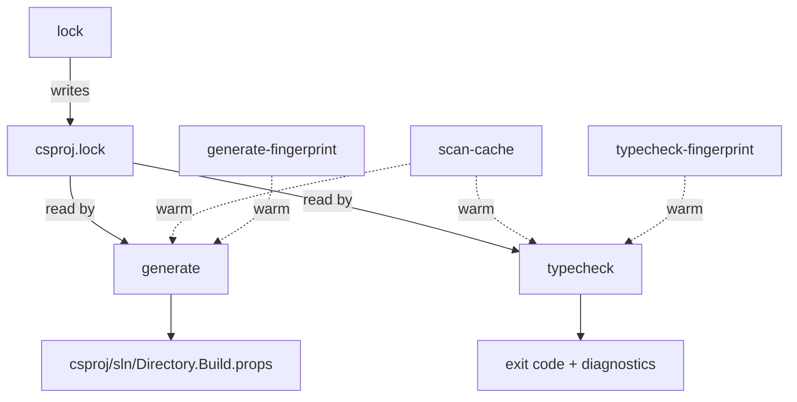

# Architecture (DRAFT v2)

> **Related:** [[CLAUDE.md]], [[benchmark.md]], [[library.md]], [[TODO.md]]
>
> Status: design draft. Phase 4 finalizes against what ships.

## Background

Ported from Swift, the codebase has accreted a few localized smells: hand-rolled `json.rs` that silently truncates on edge cases, three uncoordinated cache version constants (`SCAN_CACHE_VERSION` / `LOCK_FINGERPRINT_VERSION` / `GENERATE_FINGERPRINT_VERSION`), category-inference rules duplicated between `project_scanner.rs:116` and `solution_generator.rs:245`, parallel-walk Flusher boilerplate copy-pasted between `project_scanner` and `lockfile_scanner`. The public surface also exports flags and FFI functions no consumer uses (`init`, `--output`/`--root`, `--verbose`, `usg_lock`, `osx` platform).

This redesign trims the public surface to the **four real consumers** (audit found exactly four call sites total: two CLI via `build-unity-sln`, two FFI from Rider — both in `meow-tower` and `meow-tower-porting`), dedupes the internal accretion, and adds a `typecheck` subcommand that replaces the `build-unity-sln.sh` shell driver.

## Use cases

| Consumer | Channel | Surface needed |
|---|---|---|
| `meow-tower` Hot Reload pre-flight (`justfile:105`) | CLI | `typecheck <root> <platform> <config>` exit code |
| `meow-tower-porting` (same recipe) | CLI | same |
| Rider in-Editor regen (`ProjectGeneration.cs:91`) | FFI | `usg_generate(root, platform, "editor", ".", extraRefs)` + `usg_last_error()` |
| Rider in-Editor regen (porting) | FFI | same |

No CI, no other repos, no other tools.

## End-state layout

```
crates/
  usg-core/                 lib + bin (companion-bin idiom — drops usg-cli package)
    Cargo.toml              [lib] + [[bin]] unity-solution-generator
    src/
      lib.rs                pub API + LOCKFILE_VERSION + CACHE_VERSION constants
      main.rs               CLI dispatch — arg parse only
      lockfile.rs           Lockfile, DllRef, RefCategory, BuildPlatform, BuildConfig,
                            ProjectCategory + the ONE category-inference rule
      asmdef.rs             AsmDef record (serde_json — replaces hand-rolled json.rs)
      defines.rs            existing, unchanged
      fs.rs                 paths, write_if_changed (was paths.rs + io.rs)
      walk.rs               ONE parallel-walk helper                      ← NEW
      scan.rs               unity install + project scan
                            (merge of lockfile_scanner.rs + project_scanner.rs walk paths)
      generate.rs           render + write csproj/sln/Directory.Build.props
                            (was solution_generator.rs; rendering inline, no sub-tree)
      typecheck.rs          run(opts) -> ExitCode                         ← NEW
      lock_cache.rs         existing; reads CACHE_VERSION from lib.rs
      generate_cache.rs     existing; reads CACHE_VERSION from lib.rs
      error.rs              single Error enum
      profile.rs            unchanged
      xml.rs                unchanged (deterministic GUID is a pinned invariant)
      ⌫ json.rs             DELETED

  usg-ffi/                  unchanged shape; signatures shrunk
    Cargo.toml
    build.rs                unchanged
    src/lib.rs              shrunk: 2 fns (was 3) + simpler signatures
    tests/abi_smoke.rs      extended for new signature

dist/
  unity-solution-generator         (built bin)
  libUnitySolutionGenerator.dylib  (built FFI)
  UnitySolutionGenerator.h         (manually maintained)
  ⌫ build-unity-sln.sh             ← DELETED — typecheck subcommand replaces it
```

Net: 13 modules in `usg-core` (was 13 — `json.rs` deleted, `walk.rs` added; `paths.rs` + `io.rs` collapse to `fs.rs`; rendering inlines into `generate.rs`). Two crates instead of three.

## Public API

### CLI (binary `unity-solution-generator`)

| Subcommand | Args | Status |
|---|---|---|
| `lock` | `<root>` | unchanged |
| `generate` | `<root> <platform> <config> [--extra-refs <paths>]` | trimmed |
| `typecheck` | `<root> <platform> <config> [--extra-refs <paths>]` | NEW |

Dropped: `init` (deprecated), `--output`/`--root` (no consumer — FFI hardcodes `.`, CLI uses default variant dir), `-v`/`--verbose` (no reader), `osx` platform (no consumer — confirmed by audit; CLAUDE.md mention is aspirational).

### FFI (cdylib)

```c
int32_t usg_generate(const char *projectRoot, const char *platform,
                     const char *config, const char *outputDir,
                     const char *extraRefs);
const char *usg_last_error(void);
```

Dropped: `usg_lock` (no caller); `slnPathOut` + `slnPathOutLen` args (Rider passes `IntPtr.Zero, 0`, no other caller).

**Single-threaded contract.** Cache files aren't reentrant-safe. Document on every fn that callers must serialize. Rider naturally serializes via Unity's main-thread asset-import callback, so this matches reality — but stating it explicitly prevents a future caller from racing.

Atomic Rider `[DllImport]` update required in `meow-tower` and `meow-tower-porting` (no indirection — declaration + call site live next to each other in `ProjectGeneration.cs`).

## Versioning: two constants

```rust
// lib.rs
pub const LOCKFILE_VERSION: u32 = 1;   // user-visible csproj.lock — bump rarely + with migration note
pub(crate) const CACHE_VERSION: u32 = 1; // dev-local caches under Library/ — bump freely
```

| Artifact | Constant | Notes |
|---|---|---|
| `csproj.lock` | `LOCKFILE_VERSION` | may be checked in; format change = real migration concern |
| `scan-cache` | `CACHE_VERSION` | dev-local, gitignored |
| `lock-fingerprint` | `CACHE_VERSION` | dev-local |
| `.fingerprints/<hash>` | `CACHE_VERSION` | dev-local |
| (new) `typecheck-fingerprint/<hash>` | `CACHE_VERSION` | dev-local |

The `cache.rs` "unified module" from v1 of this design was overreach — the only thing that needs unifying is the **constant**, not the logic. Existing `lock_cache.rs` and `generate_cache.rs` stay co-located with their owners; both read `CACHE_VERSION` from `lib.rs`.

## Typecheck subsystem

Single `typecheck.rs` with `run(opts) -> Result<ExitCode>`:
1. Reuse existing scan + lockfile load.
2. Build per-asmdef `{ sources, refs, defines, analyzers }` in memory; topo-sort.
3. Compute hash of inputs → fingerprint key. If `<key>.dll-mtime` cache hits and beats all input mtimes → skip compile.
4. Otherwise: write `.rsp`, `dotnet exec csc.dll @rsp` (no `/shared` for MVP — see [[TODO.md]]).
5. Aggregate diagnostics.

The Bee-style `Plan` / `Runner` two-struct ceremony from v1 is overreach at 13 asmdefs; one function with a hashable inputs struct is enough. Pass `/analyzer:` flags so Rider's in-editor diagnostics match `typecheck` output.

**Critical: handle missing `dotnet` cleanly.** Rider runs in Unity's process where `PATH` may not include the SDK. `typecheck` must return a clear error, not panic. (CLI consumers can be assumed to have `dotnet`; FFI does not currently expose typecheck — confirmed.)

## Data flow



## Non-goals

- General "build any C# solution" tool — Unity-specific assumptions are load-bearing.
- Persistent worker / daemon process.
- Multi-platform build matrix in one CLI invocation (caller's loop).
- Replacement for `dotnet build` in `--emit` mode (use `dotnet msbuild $(unity-solution-generator generate ...)` directly if needed; audit found no consumer).
- Content-hash UTD for `.cs` files (mtime is sufficient at our scale).

## Regression test plan (lands as Checkpoint 0)

### Synthetic fixture

`crates/usg-core/tests/fixtures/regression/` (new — no existing precedent for fixture-with-stubbed-Unity-install):

```
fixture/
  Assets/Scripts/Runtime/Foo.asmdef           (no platforms → all)
  Assets/Scripts/Runtime/IOSOnly.asmdef       (includePlatforms: ["iOS"])
  Assets/Scripts/Editor/Bar.asmdef            (includePlatforms: ["Editor"])
  Assets/Scripts/Tests/Baz.asmdef             (defineConstraints: ["UNITY_INCLUDE_TESTS"])
  Packages/com.example.pkg/Pkg.asmdef         + asmref pointing into it
  ProjectSettings/ProjectVersion.txt          stub Unity install pointer
  unity-stub/Editor/Data/Managed/UnityEngine.dll  zero-byte; mtime is what matters
```

Exercises Runtime / Editor / Tests / iOS-only filtering branches in 5 asmdefs.

### Test classes

- **Golden-file** (`golden_lock`, `golden_generate_ios_editor`, `golden_generate_android_prod`): byte-equality against committed `.golden` files. `UPDATE_GOLDEN=1 cargo test` to refresh.
- **Cache-format**: version-mismatch invalidates each cache; mtime change to one asmdef invalidates only that entry; warm `lock` produces no `tracing` spans.
- **CLI smoke**: stdout sln path on `generate` (pinned — `build-unity-sln` parses it); auto-`lock` on missing lockfile (pinned — Rider FFI relies on it); exit code on invalid platform.
- **FFI smoke** (extends existing `abi_smoke.rs`): the exact Rider call pattern post-trim — `usg_generate(root, "ios", "editor", ".", extraRefs)`; `usg_last_error()` non-empty after failure.
- **Deterministic GUID**: table of `(name, expected_guid)` pairs covering meow-tower asmdef names.
- **Roslyn analyzer parity**: golden `.csproj` includes `<Analyzer Include="...">` items in the right order; `typecheck` rsp passes the same paths via `/analyzer:`.
- **`dotnet`-absent**: `PATH=` (no SDK) → `typecheck` returns clean error, no panic.

Dropped from v1: `cli_init_alias_still_works` (init being deleted), `cli_help_shows_subcommands` (theater), `render_xml_escapes_special_chars` (golden subsumes), `render_csproj_idempotent` (`write_if_changed` unit covers), FFI thread-local-safety (single-threaded contract documented instead).

## Phase 3 checkpoints

External callers update **atomically per checkpoint**. Each must leave both repos buildable and all regression tests green.

0. **Land regression tests.** All pass against current `main`.
1. **Dedupe internals.** No external impact. Extract `walk.rs`; collapse `paths.rs` + `io.rs` → `fs.rs`; replace `json.rs` with `serde_json`; single category-inference rule in `lockfile.rs`; introduce `LOCKFILE_VERSION` + `CACHE_VERSION` constants in `lib.rs`; consolidate cache-version reads.
2. **Trim surface + atomic Rider DllImport update.** Drop `init`, `--output`/`--root`, `-v`, `osx`, `usg_lock` FFI fn, `slnPathOut`/`slnPathOutLen` FFI args. Update `meow-tower` + `meow-tower-porting` `ProjectGeneration.cs` in lockstep. Fold `usg-cli` package into `usg-core` as `[[bin]]`.
3. **Add `typecheck` subcommand. Delete `build-unity-sln.sh`. Update justfiles.** Greenfield typecheck module + atomic justfile updates in both consumer repos.

Net: 4 checkpoints (was 6).

## Pitfalls (avoided by design)

- **Plugin/registry / abstract Backend trait** — one consumer; no abstraction.
- **Option-bag struct creep** — `GenerateOptions` is 5 fields. Splits before adding a 6th.
- **Persistent worker / daemon** — at 13 asmdefs, JIT amortization doesn't justify protocol burden.
- **Cache version coordination drift** — single `CACHE_VERSION` for dev-local; separate `LOCKFILE_VERSION` because lockfile may be checked in.
- **Hand-rolled JSON silently mistruncating** — replaced with `serde_json`.
- **Shell driver state accretion** — `build-unity-sln.sh`'s retry-on-failure is on the wrong side of "wrappers should be stateless"; folded into `typecheck`.

## References

- `com.unity.ide.rider` — flat library shape ([needle-mirror](https://github.com/needle-mirror/com.unity.ide.rider))
- Cargo's `cargo check` history — subcommand from day one, never a wrapper script ([RFC 3477](https://rust-lang.github.io/rfcs/3477-cargo-check-lang-policy.html))
- Roslyn Compiler Server / VBCSCompiler IPC ([Compiler Server.md](https://github.com/dotnet/roslyn/blob/main/docs/compilers/Compiler%20Server.md)) — deferred (see [[TODO.md]])
- Cargo / Bazel idiom: wholesale cache invalidation, no migrations ([Cargo Targets](https://doc.rust-lang.org/cargo/reference/cargo-targets.html), [The many caches of Bazel](https://blog.engflow.com/2024/05/13/the-many-caches-of-bazel/))
