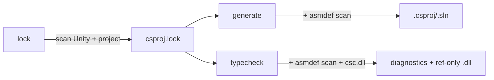

# Architecture

> **Related:** [[CLAUDE.md]], [[library-api.md]], [[benchmark.md]], [[TODO.md]]

How the tool is shaped, why, and what each piece does. Sized for a 3.6 k-LOC project with four caller sites — none of those four are CI, none are external repos beyond `meow-tower` + `meow-tower-porting`.

## Use cases

Audit found exactly **four caller sites** total. The design is sized for these and nothing else.

| Consumer | Channel | Surface |
|---|---|---|
| `meow-tower` Hot Reload pre-flight (`justfile:105`) | CLI | `unity-solution-generator typecheck` exit code |
| `meow-tower-porting` (same recipe) | CLI | same |
| Rider in-Editor regen (`ProjectGeneration.cs:91`) | FFI | `usg_generate(root, "ios", "editor", ".", extraRefs, …)` + `usg_last_error()` |
| Rider in-Editor regen (porting) | FFI | same |

No CI, no other repos, no other tools.

## Layout

```
crates/
  usg-core/                 lib + companion binary (cargo `[lib]` + `[[bin]]`)
    Cargo.toml              [lib] + [[bin]] unity-solution-generator
    src/
      lib.rs                pub API + LOCKFILE_VERSION + CACHE_VERSION constants
      main.rs               arg parse + subcommand dispatch
      lockfile.rs           Lockfile, DllRef, RefCategory, LockfileIO
      project_scanner.rs    project-side scan; AsmDefRecord, ProjectCategory
      lockfile_scanner.rs   Unity-install + project DLL/asmdef scan
      solution_generator.rs render + write csproj/sln/Directory.Build.props
      typecheck.rs          DAG walk + csc invocations
      walk.rs               shared parallel-walk helper
      lock_cache.rs         lock-fingerprint cache; reads CACHE_VERSION
      generate_cache.rs     generate-fingerprint cache; reads CACHE_VERSION
      defines.rs            version + scripting defines
      paths.rs              path utilities
      io.rs                 read/write helpers + version-header validator
      profile.rs            tracing macros
      xml.rs                escape + deterministic GUID (pinned invariant)
      error.rs              GeneratorError + LockfileError + io_err helper
    tests/                  e2e + integration + cli_regression
  usg-ffi/
    Cargo.toml              [lib] cdylib + rlib (`UnitySolutionGenerator`)
    build.rs                installs @rpath/<dylib> macOS install_name
    src/lib.rs              C ABI: usg_generate + usg_last_error
    tests/abi_smoke.rs      FFI signature pinning
```

## Top-level flow



1. **`lock`** scans the Unity installation + project to discover DLL references, analyzers, and preprocessor defines. Reads `ProjectSettings/ProjectVersion.txt` to find the Unity install path; walks `Managed/`, `NetStandard/`, `PlaybackEngines/`, `Assets/`, `Packages/`, `Library/PackageCache/`. Output: `csproj.lock`.
2. **`generate`** reads the lockfile, scans for `.cs` directories, resolves ownership via `asmdef`/`asmref` assembly roots, renders `.csproj` + `.sln` + `Directory.Build.props` for one platform+config variant. Output dir defaults to `Library/UnitySolutionGenerator/<variant>/`; overridable via the Rust API's `with_output_dir`. The depth controls compile-pattern prefix — one `../` per path component back to project root.
3. **`typecheck`** reads the lockfile + scan, builds csc args per asmdef, walks the dependency DAG level-by-level, invokes `dotnet exec csc.dll /shared` per dirty project. mtime UTD short-circuits when nothing changed; content-hash UTD prevents spurious cascade rebuilds.

## Public API

### CLI

| Subcommand | Args |
|---|---|
| `lock` | `[<root>]` |
| `generate` | `[<root>] <platform> <config> [--extra-refs <paths>]` |
| `typecheck` | `[<root>] [<platform>] [<config>] [--extra-refs <paths>]` (defaults: `ios editor`) |

`<root>` is optional — when omitted, the CLI climbs from CWD to the nearest ancestor containing `ProjectSettings/ProjectVersion.txt`.

### FFI (cdylib)

```c
int32_t usg_generate(const char *projectRoot, const char *platform,
                     const char *config, const char *outputDir,
                     const char *extraRefs,
                     char *slnPathOut, int32_t slnPathOutLen);
const char *usg_last_error(void);
```

**Single-threaded contract.** Cache files aren't reentrant-safe. Rider naturally serializes via Unity's main asset-import thread.

Full reference: [[library-api.md]].

## Category inference

Each asmdef gets a category, used to decide which projects appear in which variant:

| Rule | Category |
|------|----------|
| `defineConstraints` contains `"UNITY_INCLUDE_TESTS"` | **test** |
| `includePlatforms` is exactly `["Editor"]` | **editor** |
| `defineConstraints` contains `"UNITY_EDITOR"` | **editor** |
| Everything else | **runtime** |

Platform-specific runtime assemblies (e.g. `includePlatforms: ["iOS", "Editor"]`) are **runtime**, but only included in prod/dev variants when the target platform matches. Editor variants include all categories regardless.

## Source ownership

For each directory containing `.cs` files, the scanner walks upward to the nearest `asmdef` or `asmref` assembly root. Unresolved directories fall back to Unity's legacy assembly rules (`Assembly-CSharp`, `Assembly-CSharp-Editor`, etc.). Directories ending with `~` or starting with `.` are excluded.

## On-disk layout

All generator artifacts live under `Library/UnitySolutionGenerator/` (gitignored):

```
Library/UnitySolutionGenerator/
  csproj.lock                     ← lockfile (user-visible, may be checked in)
  scan-cache                      ← cached filesystem scan (mtime-validated)
  lock-fingerprint                ← short-circuits `lock` when nothing changed
  .fingerprints/<options-hash>    ← short-circuits `generate` when nothing changed
  ios-editor/                     ← `generate` output: .csproj + .sln + Directory.Build.props
  android-prod/
  typecheck-ios-editor/           ← `typecheck` output: csc /refonly .dlls + .rsp files
  …
```

## Cache versioning

Two `pub const u32` constants in `lib.rs`:

| Constant | Files | Bump policy |
|---|---|---|
| `LOCKFILE_VERSION` | `csproj.lock` | rarely; user-visible, may be checked in |
| `CACHE_VERSION` | `scan-cache`, `lock-fingerprint`, `.fingerprints/*`, `typecheck-*/` | freely — dev-local, gitignored |

Each cache file carries a `# version: N` header. Mismatch → wholesale invalidate. No migration code path.

## `typecheck` deeper

Bypasses MSBuild entirely. Per-asmdef args (refs from lockfile, sources from scan, defines from platform+config) are written to `<name>.rsp` and consumed via `dotnet exec /path/to/csc.dll /shared /noconfig @<name>.rsp`.

- **Native-DLL filter.** Unity's lockfile sometimes points at native plugins (e.g. `unity_sprite_author.dll`). Passing those via `/reference:` to csc fires `CS0009: PE image doesn't contain managed metadata`. We check the PE header's CLR Runtime Header data-directory entry (index 14) — non-zero RVA = managed. MSBuild's `ResolveAssemblyReferences` task does the same check.
- **Cascade skip.** If an asmdef references an upstream that failed (or was itself cascade-skipped), the downstream compile would just spew `CS0006`. We track a `failed_set` between levels and surface a `"skipped (cascade): upstream 'X' failed"` message instead.
- **Content-hash UTD.** csc with `/refonly /deterministic` produces byte-identical output for unchanged inputs, but the post-compile mtime advances anyway. We snapshot pre-compile bytes + mtime and restore the mtime via `std::fs::FileTimes::set_modified` when the new bytes match — downstream's mtime UTD then sees the upstream as unchanged and skips.
- **Parallel level dispatch.** The DAG is grouped into levels (Kahn's). Within a level all projects are independent and run concurrently via `rayon::par_iter`. Each worker spawns its own `dotnet exec csc.dll /shared`, all connecting to the same VBCSCompiler.

## Pitfalls (avoided by design)

- **Plugin/registry / abstract `Backend` trait** — one consumer; no abstraction.
- **Option-bag struct creep** — `GenerateOptions` is 5 fields. Splits before adding a 6th.
- **Persistent worker / daemon** — at this scale, JIT amortization doesn't justify protocol burden. We use `csc /shared` (which routes through VBCSCompiler) but don't host one ourselves.
- **Cache version drift** — single `CACHE_VERSION` invalidates all dev-local caches together; separate `LOCKFILE_VERSION` for the user-visible lockfile.

## Non-goals

- General "build any C# solution" tool — Unity-specific assumptions are load-bearing (asmdef layout, lockfile pointing at Unity install).
- Persistent worker / daemon process *we* run.
- Multi-platform build matrix in one CLI invocation (caller's loop).
- Replacement for `dotnet build` in `--emit` mode.
- Content-hash UTD for `.cs` source files (mtime is sufficient at our scale).

## Prior art

- **`com.unity.ide.rider`** ([needle-mirror](https://github.com/needle-mirror/com.unity.ide.rider)) — flat library, single `SyncSolution` entry point. Confirms the shape.
- **Bee** ([Unity blog](https://blog.unity.com/engine-platform/accelerating-player-builds-with-incremental-build-pipeline)) — separates *describe graph* (pure data) from *execute graph* (workers/scheduling). At our scale, kept as one `run` function with a hashable inputs struct.
- **Cargo** ([Cargo Targets](https://doc.rust-lang.org/cargo/reference/cargo-targets.html), [RFC 3477](https://rust-lang.github.io/rfcs/3477-cargo-check-lang-policy.html)) — single binary with subcommands; `cargo check` was a subcommand from day one.
- **Roslyn Compiler Server** ([Compiler Server.md](https://github.com/dotnet/roslyn/blob/main/docs/compilers/Compiler%20Server.md)) — VBCSCompiler IPC. We use `csc /shared` which connects transparently.
- **Cargo + Bazel** ([many caches of Bazel](https://blog.engflow.com/2024/05/13/the-many-caches-of-bazel/)) — wholesale cache invalidation via single version constant. No migrations.

## Profiling

Spans use [`tracing`](https://docs.rs/tracing/). Default off — zero runtime cost. Opt in:

- `USG_PROFILE=1 unity-solution-generator <cmd>` — info-level spans, one stderr line per span close with `time.busy`.
- `USG_PROFILE=full` — includes lower-level child spans.
- `USG_LOG=usg_core::project_scanner=debug` — drop-in `EnvFilter` directives.

Wall-clock benchmarks against meow-tower live in [[benchmark.md]].
