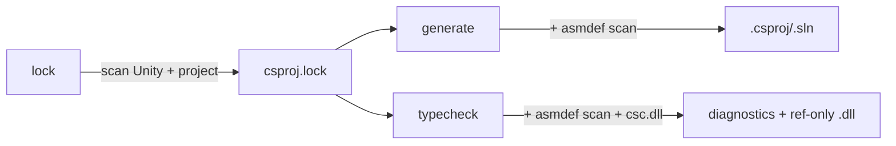

# Internals

> **Related:** [[CLAUDE.md]], [[architecture.md]], [[library.md]], [[benchmark.md]]

Mechanics of the three subcommands (`lock`, `generate`, `typecheck`) — what they read, what they write, what the rules are. Architectural decisions live in [[architecture.md]]; this doc is the "given the architecture, what does each piece actually do?" reference.

## Top-level flow



1. **`lock`** scans the Unity installation and project to discover DLL references, analyzers, and preprocessor defines. Reads `ProjectSettings/ProjectVersion.txt` to find the Unity install path, then scans `Managed/`, `NetStandard/`, `PlaybackEngines/`, `Assets/`, `Packages/`, and `Library/PackageCache/`. Output: `csproj.lock`.

2. **`generate`** reads the lockfile, scans for `.cs` directories, resolves ownership via `asmdef`/`asmref` assembly roots, and renders `.csproj` + `.sln` + `Directory.Build.props` for one platform+config variant. The output directory (defaulted to `Library/UnitySolutionGenerator/<variant>/`, overridable via the Rust API's `with_output_dir`) controls compile-pattern prefix depth — one `../` per path component back to project root.

3. **`typecheck`** reads the lockfile + scan, builds csc args per asmdef, walks the dependency DAG level-by-level, invokes `dotnet exec csc.dll /shared` per dirty project. mtime UTD short-circuits when nothing changed; content-hash UTD (compare pre/post bytes, restore mtime if identical) prevents spurious cascade rebuilds.

## Category inference

Each asmdef gets a category (used to decide which projects appear in which variant):

| Rule | Category |
|------|----------|
| `defineConstraints` contains `"UNITY_INCLUDE_TESTS"` | **test** |
| `includePlatforms` is exactly `["Editor"]` | **editor** |
| `defineConstraints` contains `"UNITY_EDITOR"` | **editor** |
| Everything else | **runtime** |

Platform-specific runtime assemblies (e.g. `includePlatforms: ["iOS", "Editor"]`) are still **runtime**, but only included in prod/dev variants when the target platform matches. Editor variants include all categories regardless.

## Source ownership

For each directory containing `.cs` files, the scanner walks upward to the nearest `asmdef` or `asmref` assembly root. Unresolved directories fall back to Unity's legacy assembly rules (`Assembly-CSharp`, `Assembly-CSharp-Editor`, etc.). Directories ending with `~` or starting with `.` are excluded.

## On-disk layout

All generator artifacts live under `Library/UnitySolutionGenerator/` (gitignored):

```
Library/UnitySolutionGenerator/
  csproj.lock                     ← lockfile (user-visible, may be checked in)
  scan-cache                      ← cached filesystem scan (mtime-validated)
  lock-fingerprint                ← short-circuits `lock` when nothing changed
  .fingerprints/<options-hash>    ← short-circuits `generate` when nothing changed
  ios-editor/                     ← `generate` output: .csproj + .sln + Directory.Build.props
  android-prod/
  typecheck-ios-editor/           ← `typecheck` output: csc /refonly .dlls + .rsp files
  …
```

## Cache versioning

Two `pub const u32` constants in `lib.rs`:

| Constant | Files | Bump policy |
|---|---|---|
| `LOCKFILE_VERSION` | `csproj.lock` | rarely; the lockfile is user-visible and may be checked in |
| `CACHE_VERSION` | `scan-cache`, `lock-fingerprint`, `.fingerprints/*`, `typecheck-*/` | bump freely — dev-local, gitignored, cold-rebuild on bump is harmless |

Each cache file carries a `# version: N` header. Mismatch → wholesale invalidate (Cargo/Bazel idiom; no migration code path).

## `typecheck` deeper details

The `typecheck` subcommand bypasses MSBuild entirely. Per-asmdef args (refs from lockfile, sources from scan, defines from platform+config) are written to `<name>.rsp` and consumed via `dotnet exec /path/to/csc.dll /shared /noconfig @<name>.rsp`.

**Native-DLL filter.** Unity's lockfile sometimes points at native plugins (e.g. `unity_sprite_author.dll`). Passing those via `/reference:` to csc fires `CS0009: PE image doesn't contain managed metadata`. We check the PE header's CLR Runtime Header data-directory entry (index 14) — non-zero RVA = managed; we filter the rest out before building the rsp. MSBuild's `ResolveAssemblyReferences` task does this same check.

**Cascade skip.** If an asmdef references an upstream that failed to compile (or was itself cascade-skipped), the downstream compile would just spew `CS0006` ("metadata file ... could not be found"). We track a `failed_set` between levels and surface a `"skipped (cascade): upstream 'X' failed"` message instead.

**Content-hash UTD.** csc with `/refonly /deterministic` produces byte-identical output for unchanged inputs. Without intervention, the post-compile `.dll` mtime advances anyway, cascading into spurious downstream rebuilds (their UTD sees `upstream.dll` as newer than their own output). We snapshot the pre-compile bytes + mtime, compare new bytes after csc returns, and restore the old mtime via `std::fs::FileTimes::set_modified` when the bytes match.

**Parallel level dispatch.** The asmdef DAG is grouped into levels (Kahn's algorithm, level-by-level). Within a level, all projects' inputs come from prior levels — they're independent and run concurrently via `rayon::par_iter`. Each worker spawns its own `dotnet exec csc.dll /shared`, all connecting to the same shared VBCSCompiler.

## Profiling

Spans use [`tracing`](https://docs.rs/tracing/). Default off — zero runtime cost. Opt in:

- `USG_PROFILE=1 unity-solution-generator <cmd>` — info-level spans, one stderr line per span close with `time.busy`.
- `USG_PROFILE=full` — includes lower-level child spans.
- `USG_LOG=usg_core::project_scanner=debug` — drop-in `EnvFilter` directives override the default.

Wall-clock benchmarks against meow-tower live in [[benchmark.md]].
